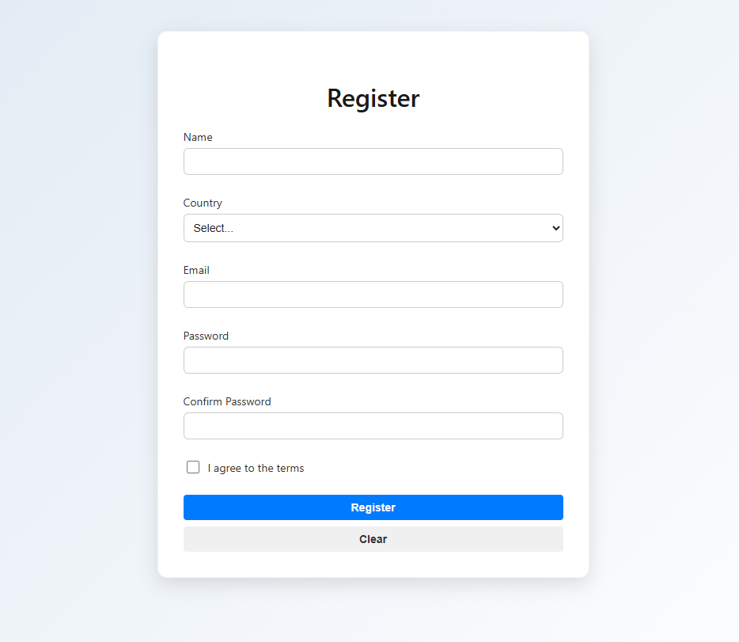

# Registration Form – React Practice Project

This project is part of a personal series of React exercises focused on improving fluency, architectural clarity, and emotionally intelligent UI design.

## Purpose

To practice:

- Modular form architecture using reducer-based state
- Editorial validation logic with reusable error handling
- Accessible field components with ARIA support
- Emotionally clear submission feedback and reset flow
- Documentation for onboarding and interview defense

## Features

- Registration form with name, email, password, country, and agreement checkbox
- Custom reducer hook for controlled form state and reset logic
- Validation hook with editorial error messages
- Success message shown after valid submission
- Scoped styling with pure CSS modules

## Structure

- `hooks/`

  - `useFormReducer`: reducer-based form state management
  - `useFormValidation`: field-level validation logic

- `components/`

  - `TextField`, `SelectField`, `CheckboxField`: modular, accessible inputs
  - `ButtonBase`: reusable button component

- `styles/`
  - `RegistrationForm.module.css`: scoped layout and form styling

## Notes

This repo is part of the **React Practice Series**, a collection of small projects designed to:

- Reinforce reusable patterns
- Improve technical storytelling
- Build confidence in architectural decisions

Each project is:

- Small in scope, big in clarity
- Documented for onboarding and reuse
- Designed to turn friction into fluency

## Next Steps

- Add loading and error states for async submission
- Integrate with backend API or localStorage
- Replace custom validation with a schema-based library (`zod`, `yup`)
- Create variants of the form for login, contact, or modal onboarding

---

For practicing React and improving proficiency.
